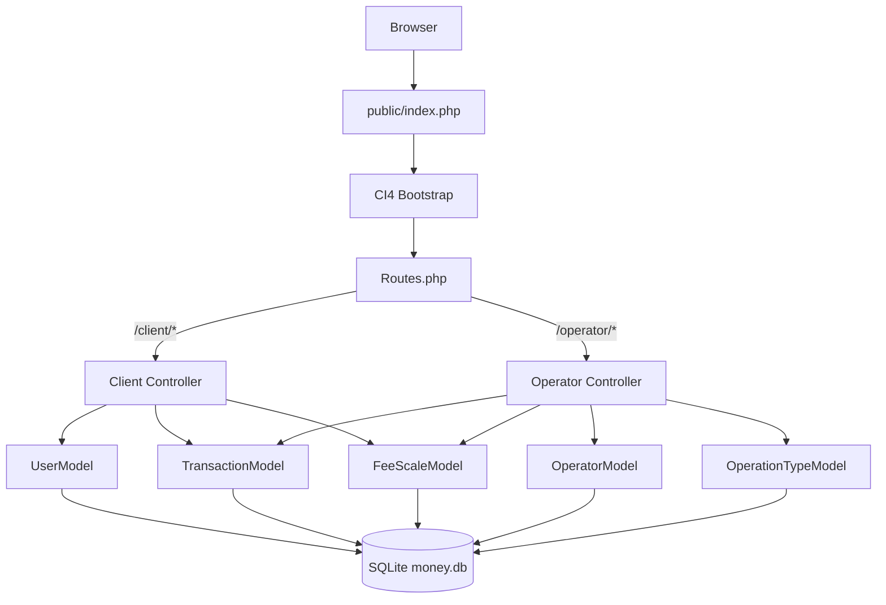

# Mobile Money — Projet Final S4

Application de gestion d'argent mobile (Mobile Money) développée avec **CodeIgniter 4**, **SQLite** embarqué et **Bootstrap 5**.

---

## Structure du projet

```
projet_final_S4/
├── app/
│   ├── Config/
│   │   ├── Database.php      ← Configuration SQLite3
│   │   ├── Filters.php       ← Enregistrement des filtres d'auth
│   │   ├── Paths.php         ← Chemins CI4
│   │   └── Routes.php        ← Toutes les routes
│   ├── Controllers/
│   │   ├── BaseController.php
│   │   ├── Home.php          ← Page d'accueil
│   │   ├── Client.php        ← Espace client
│   │   └── Operator.php      ← Espace opérateur
│   ├── Database/
│   │   ├── Migrations/       ← Création des tables
│   │   └── Seeds/            ← Données initiales (compte admin)
│   ├── Filters/
│   │   ├── ClientAuth.php    ← Garde session client
│   │   └── OperatorAuth.php  ← Garde session opérateur
│   ├── Models/
│   │   ├── UserModel.php
│   │   ├── OperatorModel.php
│   │   ├── OperationTypeModel.php
│   │   ├── FeeScaleModel.php
│   │   └── TransactionModel.php
│   └── Views/
│       ├── layouts/          ← Header/Footer Bootstrap 5
│       ├── client/           ← 6 vues client
│       └── operator/         ← 7 vues opérateur
├── public/
│   ├── index.php             ← Front controller CI4
│   ├── .htaccess             ← Réécriture URL
│   └── assets/
│       ├── css/style.css     ← Styles personnalisés
│       └── js/app.js         ← Scripts (calcul frais, etc.)
├── writable/
│   └── database/money.db     ← Base SQLite (créée automatiquement)
├── .env                      ← Configuration environnement
├── composer.json             ← Dépendances PHP
└── spark                     ← CLI CodeIgniter
```

---

## Fonctionnalités

### Côté Opérateur
| Fonctionnalité | Description |
|---|---|
| Connexion | Téléphone + mot de passe |
| Gestion des préfixes | Créer des opérateurs avec préfixes (ex: 034, 038) |
| Barèmes de frais | Configurer les frais par tranches de montant (modifiable) |
| Tableau de bord | Vue des gains par retrait et transfert |
| Comptes clients | Liste des clients selon le préfixe |
| Statistiques | Filtrage par date, breakdown par type |

### Côté Client
| Fonctionnalité | Description |
|---|---|
| Connexion auto | Numéro de téléphone uniquement, sans inscription préalable |
| Solde | Affichage temps réel du solde |
| Dépôt | Automatique, frais = 0 Ar |
| Retrait | Automatique, frais selon barème opérateur |
| Transfert | Vers n'importe quel numéro, frais selon barème |
| Historique | Toutes les transactions avec pagination |

### Barèmes de frais par défaut (retrait & transfert)

| Montant | Frais |
|---|---|
| 100 à 1 000 Ar | 50 Ar |
| 1 001 à 5 000 Ar | 50 Ar |
| 5 001 à 10 000 Ar | 100 Ar |
| 10 001 à 25 000 Ar | 200 Ar |
| 25 001 à 50 000 Ar | 400 Ar |
| 50 001 à 100 000 Ar | 800 Ar |
| 100 001 à 250 000 Ar | 1 500 Ar |
| 250 001 à 500 000 Ar | 1 500 Ar |
| 500 001 à 1 000 000 Ar | 2 500 Ar |
| 1 000 001 à 2 000 000 Ar | 3 000 Ar |

---

## Installation

### Prérequis
- PHP 8.1+
- Extensions PHP: `sqlite3`, `intl`, `mbstring`, `json`, `xml`
- Composer

### Étapes

```bash
# 1. Aller dans le répertoire du projet
cd projet_final_S4

# 2. Installer CodeIgniter 4 et les dépendances
composer install

# 3. Copier et configurer l'environnement
cp .env .env.bak    # (le .env est déjà configuré)

# 4. Créer la base de données et les tables
php spark migrate

# 5. Insérer les données initiales (compte opérateur + barèmes)
php spark db:seed DatabaseSeeder

# 6. Lancer le serveur de développement
php spark serve
```

### Accès à l'application

- **Application** : http://localhost:8080
- **Espace Client** : http://localhost:8080/client
- **Espace Opérateur** : http://localhost:8080/operator

### Compte opérateur par défaut

| Champ | Valeur |
|---|---|
| Téléphone | `0340000000` |
| Mot de passe | `Admin@1234` |

---

## Configuration du serveur web (Apache/Nginx)

### Apache — `.htaccess` (déjà inclus dans `public/`)

```apache
RewriteEngine On
RewriteCond %{REQUEST_FILENAME} !-f
RewriteCond %{REQUEST_FILENAME} !-d
RewriteRule ^(.*)$ index.php/$1 [L]
```

Le **DocumentRoot** doit pointer sur le dossier `public/`.

### PHP Built-in server (développement)

```bash
php spark serve
# ou
php -S localhost:8080 -t public/
```

---

## Architecture



---

## Logique des transactions

| Opération | Solde client | Gain opérateur |
|---|---|---|
| **Dépôt** | += montant (frais = 0) | 0 Ar |
| **Retrait** | -= (montant + frais) | frais |
| **Transfert** (envoyeur) | -= (montant + frais) | frais |
| **Transfert** (destinataire) | += montant | — |
